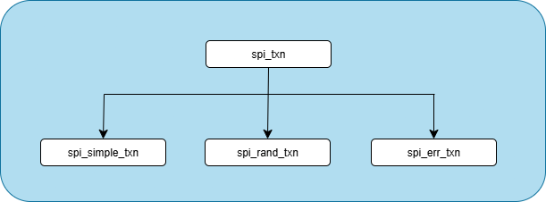
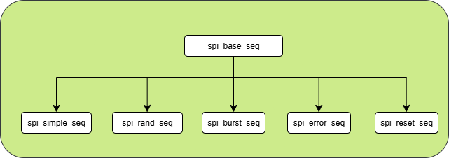
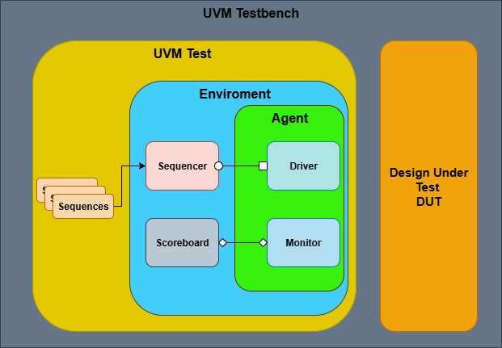

# Verification Plan: SPI

## Objective and Scope

- Verify the correct behavior of the DUT for read and write operations, error handling on invalid addresses, and write -> read data coherency
- Validate the internal protocol, generation of done/err, and expected latency
- Coverage goals: ≥95% functional, ≥90% code.

The `SPI_TOP` module integrates an SPI controller (`spi_ctrl`) and memory (`spi_mem`).  
The DUT provides read and write access to an internal 32x8 memory through a simplified SPI-like protocol.

### DUT Pinout

| Signal name | Size  | Direction | Description          |
|-------------|-------|-----------|----------------------|
| wr          | 1     | INPUT     | System clock         |
| clk         | 1     | INPUT     | Reset                |
| rst         | 1     | INPUT     | Operation select     |
| addr        | [7:0] | INPUT     | Memory address       |
| din         | [7:0] | INPUT     | Data input           |
| dout        | [7:0] | OUTPUT    | Data output          |
| done        | 1     | OUTPUT    | Operation Complete   |
| err         | 1     | OUTPUT    | Error flag           |

The DUT consists of a memory controller interfacing with an internal memory. It supports write and read transactions, error signaling for invalid addresses, and a handshake using done/err.

### Host Port Interface (spi_intf)

- clk (size = 1)
- rst (size = 1)
- wr (size = 1)
- addr (size = 8)
- din (size = 8)
- dout (size = 8)
- done (size = 1)
- err (size = 1)
- Internal (observe only): cs, mosi, miso, ready, op_done

---

## Transactions

**Host agent transactions:**

- `spi_txn`: base class for SPI transactions (fields: op, addr, wdata, exp_rdata, expect_err)
- `spi_simple_txn`: perform a single write or read at a fixed address with fixed data.
- `spi_rand_txn`: perform read/write operations with random values for address and data.
- `spi_err_txn`: force invalid operations (address >32, or illegal op) to trigger err.

---

## Sequences

**Host agent sequences:**

- `spi_base_seq`: base sequence that generates one spi_txn.
- `spi_simple_seq`: generates a single simple read or write transaction.
- `spi_burst_seq`: generates a burst of consecutive writes or reads.
- `spi_rand_seq`: generates a stream of random transactions (addresses, ops, data).
- `spi_error_seq`: generates invalid operations to test error signaling.
- `spi_reset_seq`: asserts reset during an ongoing transaction to test recovery.

---

  

## Agents

**Host agent:**

- Driver: drives wr, addr, din, and synchronizes with done/err.
- Sequencer: runs sequences of spi_txn.
- Monitor: observes all DUT signals (wr, addr, din, done, err) and taps (cs, mosi, miso, ready, op_done). Publishes observed transactions to scoreboard and coverage.

---

## Environment

- `spi_env` contains:
  - host_agent
  - spi_scoreboard
  - spi_coverage

- Connections: monitor → scoreboard & coverage.
- Tests: `spi_test_sanity`, `spi_test_rand`, `spi_test_burst`, `spi_test_error`, `spi_test_reset`, `spi_test_stress`.

---

## Coverage

- Operation type (READ, WRITE).
- Address bins: {0}, {1–30}, {31}, {≥32 invalid}.
- Data bins: {0x00, 0xFF, 0xAA, 0x55, others}.
- Burst lengths: 1, 2–3, 4–7, ≥8.
- Latency cycles: histogram.
- Error flag activations.
- Crosses: op × addr × burst length, error × addr_invalid, op × latency.

---

## Test Cases

- **Sanity**: single WRITE then READ back, expect correct data.
- **Address sweep**: WRITE/READ at 0, 1…31.
- **Burst**: WRITE consecutive block then READ back.
- **Random**: random stream of 200 ops.
- **Invalid address**: READ/WRITE at 32, 63, 255 → expect err.
- **Reset during op**: assert reset mid-transaction → DUT recovers.
- **Stress**: 1000 random ops, monitor latency.

---

## Exit Criteria

- 0 failures in regression.
- ≥95% functional coverage.
- ≥90% code coverage.
- No assertion failures.

---

## Deliverables

- Unified interface `spi_top_if` (host + taps).
- UVM testbench (agent, env, scoreboard, coverage).
- Assertions package.
- Regression scripts.
- Reports (logs, coverage, waveforms of failing cases).
